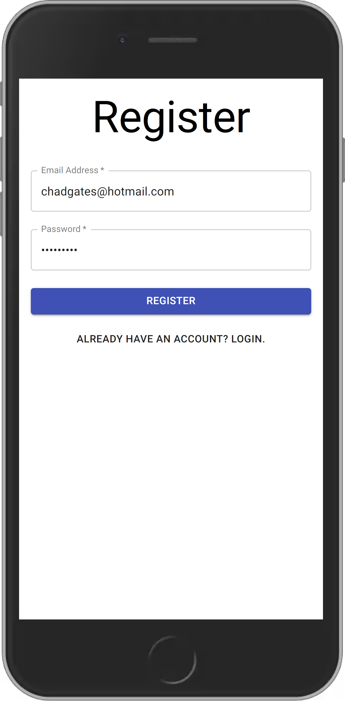
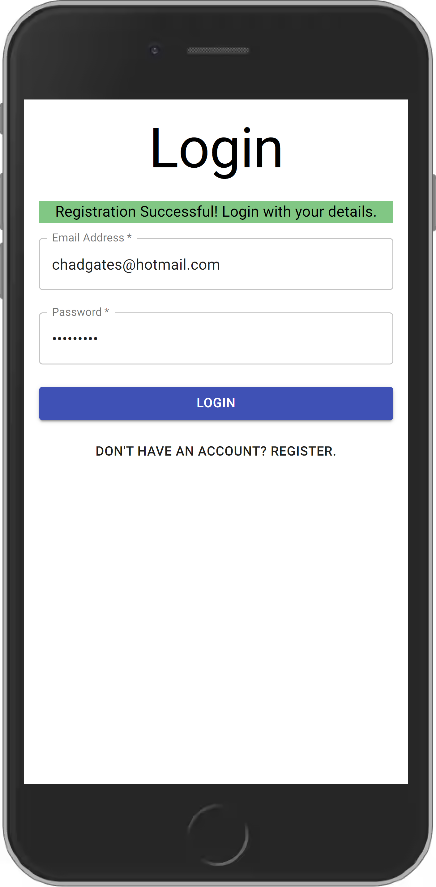
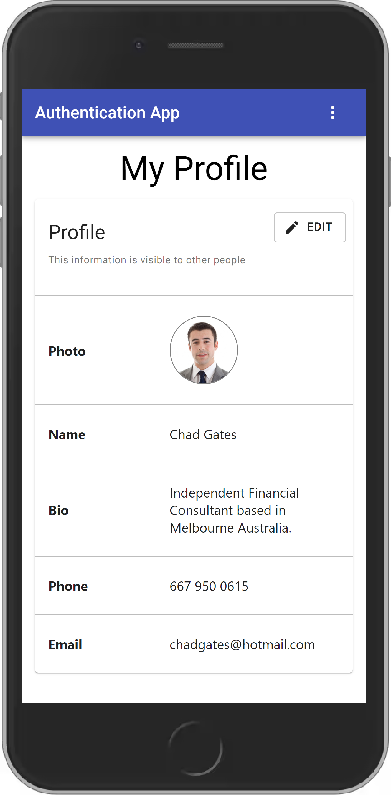
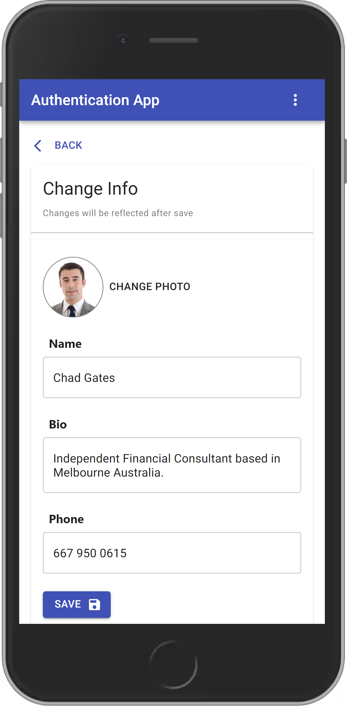
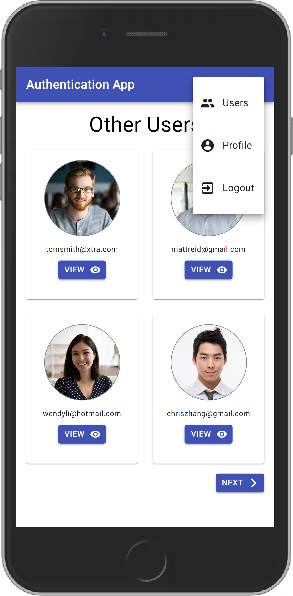
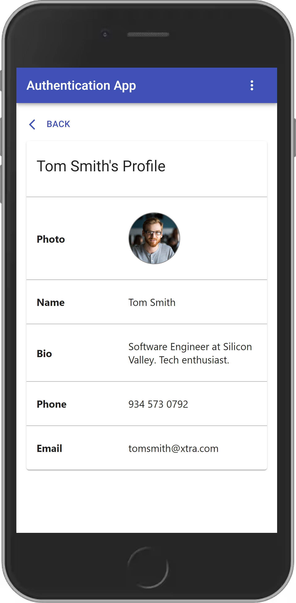

# Typescript Authentication Application

## Summary

Simple authentication application that focused on learning how to use TypeScript to create a REST API backend and served with a Create-React-App Frontend using Material-UI. Rather than focusing on the nit-picky details this project was more of an exercise on how to use the technologies and for the project to act as a reference to for the future.

Specific learning outcomes that I wanted and achieved out of this project:

- TypeScript for static type checking
- File Handling (Images)
- Handling simple local authentication (username/password)
- Using a ORM to interact with a PostgreSQL database
- Create both a desktop and mobile responsive web application

---

## Running in Development/Locally

<code>npm install</code> for both backend and frontend folders

Configure your database and TypeORM configurations appropriately. This application uses PostgreSQL and the PGAdmin Tool to easily view the database. Read more here:
https://typeorm.io/#/

Also configure your port that your backend server is running on matches the fetch requests for the frontend. Frontend is on localhost:3000 and backend is on localhost:8080.

### For backend open two terminals:

1st terminal:

```JavaScript
npm run watch // Watches for changes and compiles ts to js in dist folder
```

2nd terminal:

```JavaScript
npm run dev // Runs server using nodemon (auto restart on server)
```

This creates a chain where when you make a change in your src folder containing TypeScript, it will compile into a dist folder which these changes are detected by nodemon and automatically restarts your server when you save.

### For frontend

```JavaScript
npm start
```

---

## Packages To Implement These Learning Outcomes:

### Backend

- TypeScript
- NodeJS and Express
- Multer (File Handling)
- Passport for authentication
- Jsonwebtoken for JWT authentication
- TypeORM (Postgres) for database interaction

### Frontend

- React
- Material UI
- React Router DOM
- React Helmet

---

## Future Goals

In the future if I were to come back to this project I would:

- Add more secure authentication methods to handle the jsonwebtoken. At the moment it is stored in localStorage on the client which is prone to XSS attacks. To improve this I would implement JWT with a refresh token as well as an access token and store the refresh token in a HTTPOnly cookie as discussed here: https://hasura.io/blog/best-practices-of-using-jwt-with-graphql/

- Add advanced authentication such as two factor and forgot password features.

- Add more authentication methods (e.g. Google OAuth)

- Fully implement the social media aspect of the application. Could add followers, posts, likes and comments features.

- Setup the application for deployment (hosting, building, storing, optimizing etc.)

## Demo Pictures

All images can be found in the [demo-pics folder](./demo-pics).

<br></br>

<br></br>

<br></br>

<br></br>

<br></br>

<br></br>

